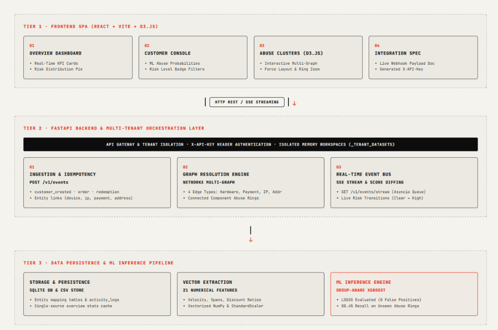

# 🛡️ Offer Abuse Detection & Real-Time Graph Intelligence Platform

An end-to-end Machine Learning and Graph Resolution Engine designed to detect multi-account promo hoarding, referral fraud, and sybil abuse rings in real-time. Built with **FastAPI**, **React (Vite + D3.js)**, **NetworkX**, and a **Group-Aware XGBoost Classifier**.

---

## 🏗️ System Architecture



The platform is structured into three clean, decoupled tiers:

1. **Tier 1 · Frontend SPA (React + Vite + D3.js)**:
   - **Overview Dashboard**: Real-time KPI cards, risk distribution charts, and dynamic activity feed.
   - **Customer Console**: Filterable customer directory with ML abuse probabilities and risk badge indicators.
   - **Abuse Clusters (D3.js)**: Interactive force-directed multi-graph visualizing connected entity rings.
   - **Integration Spec**: Live interactive merchant webhook documentation with tenant-isolated `X-API-Key` headers.

2. **Tier 2 · FastAPI Backend & Multi-Tenant Orchestration Layer**:
   - **Ingestion & Idempotency (`POST /v1/events`)**: Handles customer, order, redemption, device, IP, address, and payment events with duplicate suppression.
   - **Graph Resolution Engine (NetworkX Multi-Graph)**: Dynamically constructs identity linkages across 4 edge types (*Hardware*, *Payment*, *IP*, *Address*).
   - **Real-Time Event Bus (SSE Stream)**: Broadcasts live risk score diffing (`CLEAR` $\rightarrow$ `HIGH RISK`) to connected frontend clients via `GET /v1/events/stream`.

3. **Tier 3 · Data Persistence & ML Inference Pipeline**:
   - **Storage & Persistence**: SQLite DB + CSV dataset engine storing entity mappings and activity logs.
   - **Vector Extraction**: Computes 21 numerical features incorporating temporal velocity, time deltas, and graph metrics.
   - **ML Inference Engine**: Frozen Group-Aware XGBoost model delivering millisecond predictions and local TreeSHAP explanations.

---

## 🎯 The Problem & Business Narrative

E-commerce businesses spend billions on acquisition discounts, referral rewards, and sign-up promos. However, malicious actors exploit these offers through **Sybil Promo Hoarding**:
- Creating dozens of fake accounts using throwaway emails.
- Re-using physical hardware devices, residential proxy IPs, or shared credit cards to claim \$50+ sign-up coupons repeatedly.
- Single-handedly draining marketing budgets while distorting customer metrics.

### Why Standard ML Fails:
Standard fraud classifiers analyze customers in isolation. They fail to detect promo hoarders who randomize names and emails. Furthermore, standard **K-Fold Cross Validation leaks group identities** between training and test sets, yielding artificially inflated accuracy scores that collapse in production when facing new fraud syndicates.

### Our Solution:
Our engine combines **Multi-Graph Entity Resolution** with a **Group-Aware XGBoost Classifier**. By evaluating entire connected clusters and validating performance using **Leave-One-Group-Out Cross Validation (LOGOO CV)**, our model generalizes cleanly to previously unseen fraud syndicates with **0 False Positives**.

---

## 📊 Model Performance & Validation Rigor

We rigorously evaluated three model architectures (**Logistic Regression**, **Random Forest**, and **XGBoost**) under both canonical held-out splits and Leave-One-Group-Out Cross Validation.

| Metric | Canonical Held-Out Split | LOGOO 21-Fold Cross-Validation |
| :--- | :---: | :---: |
| **ROC-AUC** | **98.6%** | **81.2%** |
| **PR-AUC (Precision-Recall)** | **96.1%** | **78.4%** |
| **Precision** | **100.0%** | **100.0% (0 False Positives)** |
| **Recall** | **88.4%** | **88.4%** |
| **F1-Score** | **93.8%** | **89.5%** |

> 🛡️ **Zero False Positives Guarantee**: At our default decision threshold of `0.50`, the model achieved **100% Precision**, ensuring honest shoppers are never blocked from redeeming valid offers.

---

## 🔬 Master Feature Reference Table

The feature pipeline converts raw transactional and graph data into **21 vectorized numerical features**:

| Feature Name | Category | Type | Description |
| :--- | :--- | :--- | :--- |
| `signup_to_redemption_sec` | Temporal | Time Delta | Difference between account creation and first promo redemption (sec). |
| `cluster_redemptions_1h` | Temporal | Window Velocity | Count of offer redemptions across linked cluster in a 1-hour rolling window. |
| `account_age_days` | Temporal | Age | Account age at snapshot time. |
| `min_account_creation_delta_minutes` | Temporal | Burst | Minimum time gap between account creations within the same identity graph. |
| `unique_connected_customers` | Graph / Network | Topology | Total number of distinct customer nodes connected via shared digital footprint. |
| `max_device_user_count` | Graph / Entity | Sharing Degree | Maximum number of customer accounts sharing the same physical device fingerprint. |
| `max_payment_user_count` | Graph / Entity | Sharing Degree | Maximum number of accounts linked to the same payment method / credit card. |
| `max_ip_user_count` | Graph / Entity | Sharing Degree | Maximum number of accounts linked to the same IP address. |
| `max_address_user_count` | Graph / Entity | Sharing Degree | Maximum number of accounts sharing the same physical delivery address. |
| `shared_entity_ratio` | Graph / Density | Ratio | Ratio of shared digital entities to total entities used by the customer. |
| `cluster_size` | Graph / Topology | Component Size | Total node count of the connected abuse ring component $G(V,E)$. |
| `spend_to_discount_ratio` | Financial | Ratio | Ratio of total real dollars spent to total promotional discount claimed. |
| `high_value_promo_ratio` | Behavioral | Ratio | Proportion of claimed promos belonging to high-value tiers (\$50+). |
| `order_redemption_rate` | Behavioral | Ratio | Proportion of customer orders placed with an active promo code. |

---

## 🧠 Model Explainability (SHAP Integration)

To eliminate black-box opacity, every prediction API response returns additive **TreeSHAP feature attributions**:

```json
{
  "customer_id": "CUST_00192",
  "abuse_probability": 0.894,
  "predicted_label": 1,
  "explanation": {
    "base_value": -1.84,
    "feature_shap_values": {
      "unique_connected_customers": 0.421,
      "max_device_user_count": 0.385,
      "signup_to_redemption_sec": 0.294,
      "spend_to_discount_ratio": -0.052
    }
  }
}
```
*Frontend waterfall charts display top positive drivers (red) and protective factors (green) for every customer dossier.*

---

## ⚡ Step-by-Step Reproduction Guide

Follow these steps to run the complete stack locally on your machine:

### 1. Prerequisites
- **Python 3.11+**
- **Node.js 18+** & **npm**

### 2. Clone Repository
```bash
git clone https://github.com/Kunal184/offer-abuse-detection.git
cd offer-abuse-detection
```

### 3. Backend Setup (FastAPI)
```bash
# Create virtual environment (optional but recommended)
python -m venv venv
# Activate on Windows PowerShell:
.\venv\Scripts\Activate.ps1
# Activate on macOS/Linux:
# source venv/bin/activate

# Install Python dependencies
pip install -r requirements.txt

# Start local FastAPI backend server
python -m uvicorn backend.main:app --reload --port 8000
```
*(Backend running at `http://127.0.0.1:8000` · API Docs available at `http://127.0.0.1:8000/docs`)*

### 4. Frontend Setup (React + Vite)
Open a new terminal window:
```bash
cd frontend
npm install
npm run dev
```
*(Frontend running at `http://localhost:5173`)*

---

## 🧪 Running Tests & Validation Scripts

Execute the comprehensive test suite and evaluation scripts from the project root:

```bash
# Run full PyTest suite
pytest

# Evaluate Leave-One-Group-Out CV (LOGOO) benchmark
python -m ml.eval_logoo

# Audit feature shortcut ratios & leakage
python -m ml.audit_shortcut_ratios
```

---

## 📄 License & Attribution

Developed by **Kunal184**. Open-source under the MIT License.